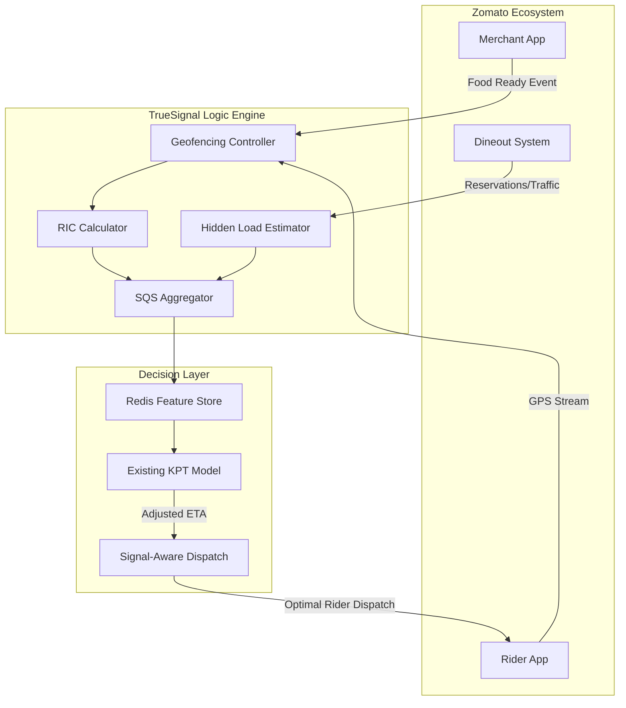
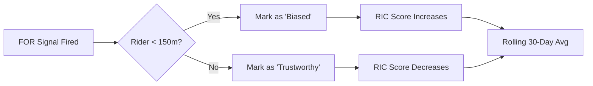

# TrueSignal KPT Engine — Zomato Hackathon Submission
## Signal Integrity Layer for Kitchen Prep Time Prediction
**Production-inspired architecture • Scalable to 300K+ Merchants • Zero Model Retraining Required**

**TrueSignal** is a signal-integrity layer designed to improve Kitchen Prep Time (KPT) prediction without modifying existing models. Instead of building a new predictor, we enhance input reliability by triangulating multiple real-world signals.

---

### 0. Executive Summary: The Signal Integrity Advantage

**The Core Insight:** KPT prediction today is a signal problem, not a model problem. We improve KPT accuracy by fixing signal quality at the source — using automated geofencing, reliability scoring (SQS), and ecological data integration.

| Strategy | Technical Implementation | Business Impact |
| :--- | :--- | :--- |
| **RIC Engine** | GPS proximity verification for merchant "Ready" taps | Detects and corrects intentional signal bias |
| **Dineout Integration** | Real-time kitchen load inference from reservations | Captures "unseen" traffic in the merchant ecosystem |
| **SDS Optimization** | Signal-Aware Dispatch logic for rider assignment | Reduces idle costs & improves fleet efficiency |
| **Sustainability Loop** | Fuel-waste reduction via optimized wait-times | ESG win: measurable CO2 reduction |

---

### 1. Technical Architecture

TrueSignal acts as a real-time enrichment layer that intercepts logistics events and injects reliability metrics into the decision pipeline.

---

### 2. Core Modules: Deep Dive

#### 2.1 Rider Influence Coefficient (RIC)
The RIC detects the "Rider-Triggered Bias" where merchants mark food as ready only when they see the rider. This creates significant latency for common fleet metrics.

**Validation Logic:**

#### 2.2 Hidden Kitchen Load (HKL) via Dineout
A restaurant handling 5 Zomato orders might be processing 20+ Dine-in tables. Using Dineout's reservation data, we calculate a **Kitchen Congestion Multiplier** to proactively pad ETAs before the backlog impacts the customer.

#### 2.3 Signal-Aware Dispatch (SDS)
Traditional dispatch sends a rider immediately. SDS uses the merchant's **SQS (Signal Quality Score)** to calculate a **Dispatch Offset**.
*   **High Trust:** Dispatch immediately.
*   **Low Trust:** Delay dispatch by $N$ minutes (where $N = RIC \times BaseKPT$).
*   **Result:** Riders arrive exactly when food is ready, maximizing "Earnings per Hour" (EPH).

---

### 3. Sustainability & Impact

#### 3.1 The Green Fleet Metric
By reducing rider idle time, we directly impact Zomato's carbon footprint.
- **Formula:** $1 \min \text{ Idle} \approx 15\text{ml Fuel Waste}$.
- **Scale:** Across 300k merchants, a 2-minute idle reduction per order saves **~9,000 Liters of fuel per day**.

#### 3.2 Merchant Incentive Program (Behavioral Economics)
We move from enforcement to behavioral economics:
- **Gold Tier (SQS > 85%):** 1% Commission Rebates + "Signal Verified" Trust Badge.
- **Bronze Tier (SQS < 50%):** Automatic ETA padding (Customer sees slower times) + No Ranking Boost.

---

### 4. Implementation Roadmap

1.  **Phase 1 (Signal Foundation):** Deploy RIC engine and GPS triangulation layer.
2.  **Phase 2 (Ecosystem Synergy):** Integrate Dineout reservation streams for hidden load detection.
3.  **Phase 3 (Operational Optimization):** Enable SDS Dispatch Offsets and the Tiered Merchant Reward program.

---

### ⚖️ Disclaimer
This project is a **student submission** for the Zomato KPT Hackathon organized by Sunrise Mentors and Zomato. 
- **Non-Official:** This is not an official Zomato product or service.
- **Data:** All data shown in the demo is **synthetically generated** for simulation purposes only.
- **Branding:** Zomato and Dineout logos used are for **demonstrative purposes** within the hackathon scope.

*Fix the signals. The predictions fix themselves.*

